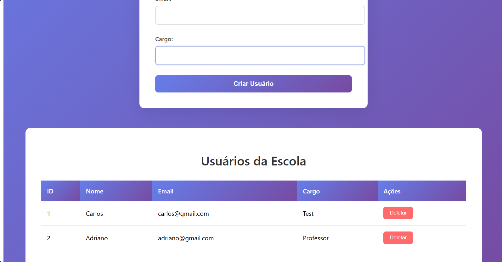

# school-app

Frontend em Angular para o sistema de gerenciamento escolar.

Backend do projeto: [SchoolApi](https://github.com/Jx-dev-c/SchoolApi) *(ASP.NET Core)*


## Stack

- Angular 22 (standalone components)
- TypeScript
- RxJS
- SSR habilitado

## Funcionalidades

- Cadastro de usuários via formulário
- Listagem em tabela com atualização automática
- Exclusão com confirmação
- Estados de carregamento e tratamento de erro

## Como executar

Requer a API rodando em `http://localhost:5105`.

```bash
npm install
ng serve
```

Aplicação disponível em `http://localhost:4200`.

## Decisões técnicas

- **Comunicação entre componentes via `Subject`:** o formulário e a lista são componentes irmãos e não se conhecem. Quando um deles altera dados, notifica o service, que transmite a mudança a quem estiver inscrito. Evita acoplamento através do componente pai.
- **`unsubscribe` no `ngOnDestroy`:** a inscrição no `Subject` é encerrada junto com o componente para evitar vazamento de memória.
- **`ChangeDetectorRef`:** usado para forçar a atualização da view após respostas assíncronas da API.
- **Tipagem forte:** a interface `Usuario` é compartilhada entre service e componentes.

## Roadmap

- [ ] Edição de usuário (endpoint PUT já disponível na API)
- [ ] Validação reativa de formulário
- [ ] Testes com Jasmine/Karma